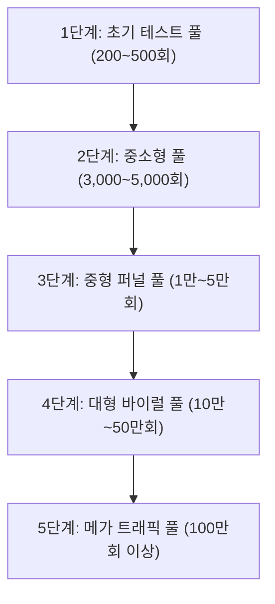

틱톡(TikTok)의 중국 내수용 오리지널 버전이자 전 세계 숏폼 트렌드의 발원지인 **도우인(Douyin)**은 현존하는 가장 정밀하고 강력한 콘텐츠 추천 인공지능 알고리즘을 보유하고 있습니다. 유튜브 쇼츠, 인스타그램 릴스 등 대부분의 글로벌 플랫폼이 도우인의 알고리즘 모델과 추천 로직을 벤치마킹하여 설계되었다는 것은 업계의 정설입니다. 따라서 2026년 현재 도우인 알고리즘의 최신 변화와 메커니즘을 제대로 이해하는 것은 단순히 중국 시장 진출을 넘어, 국내 숏폼 마켓에서 독보적인 트래픽을 선점할 수 있는 가장 확실한 지름길입니다.

이번 포스팅에서는 도우인 알고리즘의 핵심인 트래픽 풀 작동 원리부터 시청자의 시선을 묶어두는 3초 훅 설계법, 그리고 인게이지먼트 점수를 극대화하는 편집 기법까지 조회수 폭발을 위한 3가지 바이럴 전략을 심층 분석합니다.

---

## 1. 도우인 추천 시스템의 심장: 5단계 트래픽 풀(Traffic Pool) 작동 원리

도우인의 알고리즘은 철저하게 **'트래픽 풀(Traffic Pool) 퍼널 시스템'**에 기반하여 작동합니다. 영상이 업로드되는 순간부터 수백만 명에게 퍼지기까지의 여정은 크게 5단계의 검증 단계를 거치게 되며, 각 단계마다 AI가 요구하는 정량적 지표를 충족해야 다음 단계로의 문이 열립니다.

### ① 1단계: 초기 테스트 풀 (200 ~ 500회 노출)
영상이 업로드되면 플랫폼 AI는 비디오의 메타데이터(자막, 더빙 음성 변환 텍스트, 해시태그)를 스캔하여 적절한 카테고리를 분류한 뒤, 무작위 사용자 및 해당 주제에 관심을 보였던 **200~500명의 소규모 초기 테스트 그룹**에게 비디오를 노출합니다. 이 단계에서 이탈률이 매우 높거나 신고를 받지 않는 한, 대부분의 영상이 공평하게 거치는 첫 번째 관문입니다.

### ② 2단계: 중소형 풀 (3,000 ~ 5,000회 노출)
초기 테스트 그룹에서 얻은 반응 점수(완독률, 좋아요 비율, 댓글 참여도)를 종합 계산하여, 합산 점수가 카테고리 평균치를 초과할 경우 **3,000~5,000명의 확장 풀**로 진입합니다. 이 단계부터는 사용자의 관심도가 조금 더 폭넓게 확장되기 때문에 콘텐츠 매력도가 떨어지면 급격한 조회수 정체 현상을 겪게 됩니다.

### ③ 3단계: 중형 퍼널 풀 (1만 ~ 5만회 노출)
콘텐츠의 본질적인 힘이 증명되어야 도달할 수 있는 퍼널입니다. 시청자의 평균 시청 시간과 상호작용율(댓글 작성률, 공유 및 저장률)을 종합 평가하여 상위 10% 이내의 우수 지표를 기록한 영상만이 이 풀에 안착합니다. 이때부터는 **도우인 추천 피드(For You Page)의 핵심 유입 경로**를 타기 시작합니다.

### ④ 4단계: 대형 바이럴 풀 (10만 ~ 50만회 노출)
본격적인 대세 콘텐츠 반열에 오르는 단계입니다. 일반 대중에게 광범위하게 노출되며, 시청 타겟층의 경계가 무너지고 대중적인 바이럴이 형성됩니다. 이 단계에서는 영상의 초반 유입뿐만 아니라 **'끝까지 본 비율(완독률)'**이 절대적인 영향력을 발휘합니다.

### ⑤ 5단계: 메가 트래픽 풀 (100만회 이상 노출)
도우인 메인 페이지의 인기 트렌딩 탭 및 핫이슈 카테고리에 실시간으로 등록되어 수백만 명에게 동시 다발적으로 송출됩니다. 플랫폼 전체의 유행을 선도하는 영상이 여기에 속합니다.

---

## 2. 초반 3초 이탈률을 막기 위한 시각적·청각적 장치 설계법

도우인 내부 데이터에 따르면, 평균적인 숏폼 유저는 영상을 시청하기 시작한 지 **첫 3초 이내에 화면을 쓸어 넘길지(Swipe) 끝까지 시청할지를 결정**합니다. 즉, 3초 동안 시청자를 붙잡아두는 강력한 '훅(Hook)'을 설계하지 못한다면, 뒤에 아무리 훌륭한 정보와 연출이 있더라도 1단계 테스트 풀조차 돌파할 수 없습니다.

### ① 시각적 훅(Visual Hook): 패턴 인터럽트(Pattern Interrupt)
시청자가 스마트폰을 위로 올리며 반복적인 스와이프를 할 때, 예상치 못한 시각적 자극으로 뇌의 무의식적인 동작을 멈추게 해야 합니다.
* **1초 프레임 반전/이색 구도:** 극단적인 클로즈업 샷이나 기이하게 기울어진 구도, 또는 흑백 화면에서 컬러 화면으로 변환되는 찰나의 효과를 영상 첫 프레임에 배치합니다.
* **대형 후킹 자막 카드:** 영상 상단이나 중앙에 큰 폰트로 궁금증을 자극하는 문장을 띄웁니다. 단순한 타이틀보다는 **"아무도 가르쳐주지 않는 ~의 실체"**, **"이것만 피하면 ~는 성공합니다"**와 같은 경고성 혹은 이익 제시형 텍스트 카드를 배치해 눈이 먼저 가독하도록 유도해야 합니다.

### ② 청각적 훅(Auditory Hook): 뇌리에 꽂히는 사운드 설계
* **인트로 질문의 오디오 타격:** 배경음악(BGM)보다 말소리가 먼저 시작되도록 하여 귀를 먼저 자극해야 합니다. 성우 톤의 목소리나 명확한 목소리로 첫 단어(예: **"잠깐만요!"**, **"혹시 아직도 ~하고 계신가요?"**)를 임팩트 있게 뱉어내십시오.
* **효과음(SFX) 배치:** 시각적 타이틀 자막이 열릴 때 글자 소리나 주의를 집중시키는 효과음(예: 딩동, 찰칵, 심장박동음)을 정확한 타이밍에 믹싱해 청각적 집중력을 극대화해야 합니다.

---

## 3. 시청 지속 시간과 상호작용(댓글, 공유) 점수를 높이는 편집 기술

도우인의 인공지능이 점수를 계산할 때 가장 가중치를 높게 두는 항목은 **'평균 시청 지속 시간(Average Watch Time)'**과 **'상호작용성(Interaction Rate)'**입니다. 이를 자연스럽게 유도하는 기술적인 3가지 편집 노하우를 제안합니다.

### ① 1.5초 루프 호흡 기법
화면이 2초 이상 멈춰있거나 호흡이 루즈해지면 시청자는 지루함을 느낍니다. 컷 편집 시 모든 클립의 길이를 **1.5초 안팎으로 미세하게 잘라 연결**하고, 클로즈업과 바스트 샷을 번갈아 사용하십시오. 또한 카메라 구도를 미세하게 확대/축소하는 줌(Zoom) 효과를 프레임마다 리드미컬하게 추가하면 정적인 설명 위주의 콘텐츠라 하더라도 긴장감과 집중력을 유지시킬 수 있습니다.

### ② 논쟁 유도형 아웃트로와 댓글 고정 기법
알고리즘에서 '댓글 수'는 엄청난 품질 가산점을 부여받습니다. 시청자들이 자발적으로 키보드를 켜게 하려면 영상 말미에 확정적인 결론을 내리기보다, 열린 질문이나 찬반이 나뉘는 화두를 던지는 것이 유리합니다.
* **실전 예시:** 영상의 마지막 5초에 **"여러분이라면 A를 고르시겠습니까, B를 고르시겠습니까?"**라는 질문 자막 카드를 띄우고, 댓글란의 첫 번째 고정 댓글(Pinned Comment)로 **"저는 개인적으로 A라고 생각하는데 여러분 의견은 어떤가요?"**라는 유도 멘트를 심어 토론의 장을 만들어냅니다.

### ③ 저장(Bookmark)과 공유를 자극하는 정보 밀집 구간 삽입
시청자가 영상을 북마크하거나 카카오톡 등 외부 메신저로 친구에게 링크를 공유하는 행위는 플랫폼 AI에게 '이 콘텐츠는 아주 높은 가치를 담고 있다'는 신호를 전송합니다. 
* **구체적 실전 팁:** 영상 후반부에 유용한 팁 요약 화면이나 체크리스트 표를 약 1초간 빠르게 보여주며 **"내용이 너무 많으니 일단 이 화면을 저장해 두시고 하나씩 실천해 보세요"** 혹은 **"도움이 필요한 친구에게 이 꿀팁을 전송하세요"**라는 내레이션과 함께 화살표 모션을 강조 표시합니다. 정보를 정독하기 위해 영상을 일시 정지하거나 다시 돌려보는 과정에서 자연스럽게 **누적 시청 시간 점수**도 함께 수직 상승하게 됩니다.

---

> ### 💡 크리에이터를 위한 알고리즘 부스터
> **알고리즘을 폭발시키는 치트키 멘트가 필요하다면?**  
> 👉 [**[ShortsPack Pro 알고리즘 폭발 CTA 생성기] 사용해보기**](/algo-hook-generator)

---

## 결론: 지속성 있는 성장을 위한 알고리즘 친화적 영상 기획

도우인 추천 시스템의 작동 원리는 단순히 자극성 높은 영상을 우대하는 편향된 구조가 아닙니다. AI 필터링 엔진은 유저의 시선 정착도와 참여 리액션을 정밀한 매트릭스로 변환하여 품질 점수를 산출합니다.

크리에이터로서 조회수 정체를 극복하기 위해서는 5단계 트래픽 풀의 허들을 뛰어넘을 수 있는 명확한 수치 설계가 선행되어야 합니다. 초반 3초에 집중하는 패턴 인터럽트 설계, 1.5초 단위의 스피디한 편집 템포, 그리고 댓글과 저장을 적극 유도하는 스토리라인 기획을 종합적으로 적용해 보십시오. 단기간에 바이럴 임계점을 돌파하며 여러분의 채널 조회수가 급격하게 상승하는 기적을 경험하실 수 있을 것입니다.

블로그 게시글의 내용이나 숏폼 알고리즘 그로스 해킹에 관해 추가로 궁금한 점이 있으시거나 비즈니스 관련 제휴 문의가 있으신 경우 공식 이메일인 **ksg0611@gmail.com**으로 언제든 편하게 연락 부탁드립니다.
